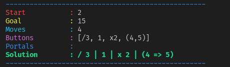

# calculator-solver

Program to solve ["Calculator: The Game"](https://play.google.com/store/apps/details?id=com.sm.calculateme)

## How it works

The goal of the game is to get from a starting value to the `goal` by pressing `moves` amount of buttons who each apply some action to the current value or the buttons themselves.

The implementations works with State Monads where each button press mutates the State (value of the accumulator and buttons). All possible combinations of button presses are checked until the first one is found. Some combinations may be invalid when a button can't be pressed, such as when dividing would lead to a non integer value.

## Example
